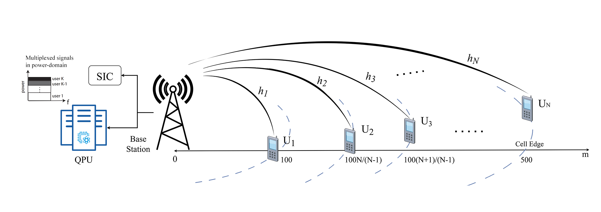
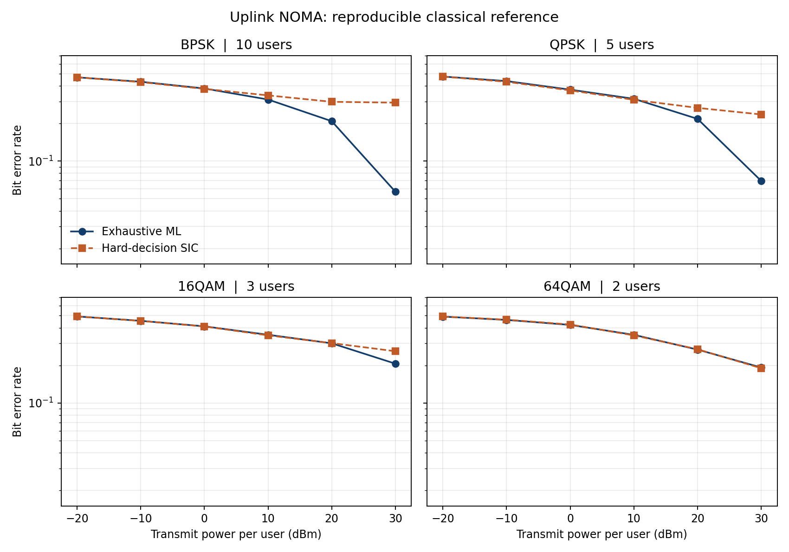

# Quantum annealing for uplink NOMA detection

**EE599 graduation project · University of Tripoli · Mohamed S. Abuain · 2024**

This project studies maximum likelihood (ML) detection for power-domain non-orthogonal multiple access (NOMA). Several users transmit simultaneously to one base station. Their superposed, fading signals make joint symbol detection a combinatorial problem. I formulate the received-signal least-squares objective as a quadratic unconstrained binary optimization (QUBO) problem, solve it with a D-Wave quantum annealer, and compare its detection behavior with exhaustive ML search and successive interference cancellation (SIC).

The research was presented as my EE599 graduation thesis under the supervision of Dr. Osama M. Abusaid and received the **Libyan Innovation Award for Best Graduation Project (2024)**. The [thesis](docs/EE599-thesis.pdf) and [research paper](docs/quantum-annealing-noma-paper.pdf) provide the full derivation and original experimental results.



## What the project demonstrates

- A binary encoding of BPSK, QPSK, 16-QAM, and 64-QAM symbols and a direct expansion of the joint ML objective into QUBO coefficients.
- A shared-frame comparison of exhaustive ML and a strongest-channel-first, hard-decision SIC receiver under independent Rayleigh fading, distance-dependent path loss, and complex AWGN.
- An optional D-Wave Leap run that submits the same QUBO for a received frame and reports its best sample, objective energy, solver, and timing metadata.
- Reproducible plots and a notebook for inspecting the model, checking the QUBO identity, comparing receivers, and trying a QPU run.

The classical results generated by this repository are a fresh, seeded reference experiment. They use the parameters documented below and are **separate from the historical QPU measurements and figures in the thesis**. In the original experiments, quantum annealing approached exhaustive ML detection quality in the examined settings, while QPU access and sampling took longer than the classical methods. A lower BER in an isolated historical QA point should not be read as an improvement over exact ML: the original plots used different Monte Carlo runs and power increments.



## Reproduce the results

Use Python 3.10 or newer. From the repository root:

```bash
python -m venv .venv
source .venv/bin/activate
python -m pip install -e .
python scripts/reproduce.py
jupyter lab notebooks/noma_detection.ipynb
```

On Windows, activate with `.venv\Scripts\activate`. The script writes `results/reproduced/classical_baselines.csv` and `classical_baselines.png`. Its default run uses 1,000 independently drawn frames per power point and a fixed seed. For a faster check, run `python scripts/reproduce.py --frames 100`; sampling variation will be larger.

The four scenarios have 10 BPSK users, 5 QPSK users, 3 16-QAM users, and 2 64-QAM users, respectively. Each uses per-user transmit powers of −20, −10, 0, 10, 20, and 30 dBm; total complex noise power of −60 dBm; path-loss exponent 2.7; and distances listed in [`scripts/reproduce.py`](scripts/reproduce.py). Rayleigh fading, transmitted bits, and noise are newly sampled for each frame. ML and SIC evaluate **the same frames**, and BER is bit errors divided by all transmitted bits. The bit labels are binary amplitude labels, not Gray coding; QAM uses peak-amplitude normalization. These conventions matter when comparing BER values with other simulations.

### D-Wave Leap run

The notebook's final section contains an optional live QPU experiment. Install the Ocean integration and configure your [D-Wave Leap credentials](https://docs.dwavequantum.com/en/latest/ocean/leap_authorization.html):

```bash
python -m pip install -e '.[qpu]'
dwave setup
```

Set `RUN_QPU = True` in the notebook and run the final cell. It builds a QUBO for one BPSK frame and calls `EmbeddingComposite(DWaveSampler()).sample_qubo(...)`. Solver access and quota are supplied by your own Leap account. The cell compares the returned bit vector with exhaustive ML for that **same frame**. It does not claim that a single QPU read or one frame establishes a BER result.

## Repository guide

| Path | Contents |
| --- | --- |
| [`notebooks/noma_detection.ipynb`](notebooks/noma_detection.ipynb) | Walkthrough of signal generation, QUBO derivation checks, four modulation scenarios, and optional QPU sampling |
| [`src/noma_detection.py`](src/noma_detection.py) | Channel model, symbol maps, QUBO expansion, ML and SIC receivers, and Leap adapter |
| [`scripts/reproduce.py`](scripts/reproduce.py) | Seeded BER sweep and figure/CSV generation |
| [`tests/test_detection.py`](tests/test_detection.py) | Checks of the QUBO identity, minimizer agreement, BER accounting, and deterministic frames |
| [`results/reproduced/`](results/reproduced/) | Generated classical baseline data and figure |
| [`assets/`](assets/) | Selected diagrams and original thesis figures |
| [`docs/`](docs/) | EE599 thesis and research paper |

Run the checks with `python -m unittest discover -s tests -v` after installing the package.

## Model and formulation

For one received complex sample, the uplink model is

$$y = \sum_{k=1}^{K} h_k\sqrt{P_k}s_k+n,$$

where each $h_k$ contains Rayleigh fading and distance-dependent path loss. For a fixed frame, write the encoded symbols as $s_k=c+\sum_b w_b q_{kb}$ with $q_{kb}\in\{0,1\}$. With $d=y-c\sum_k H_k$ and $A_{kb}=H_kw_b$, the ML residual becomes

$$\left|d-\sum_i A_iq_i\right|^2 = |d|^2 + \sum_i\left(|A_i|^2-2\mathrm{Re}(d^*A_i)\right)q_i + \sum_{i<j}2\mathrm{Re}(A_i^*A_j)q_iq_j.$$

The nonconstant terms are the QUBO. `qubo_from_frame` returns both the coefficients and the constant offset so that their energy can be checked against the original residual. The exhaustive solver searches at most 16 binary variables in these teaching scenarios; that cap keeps the classical comparison practical and is not a scalability result.

## Project context and attribution

The original study drew on [D-Wave's coordinated multipoint example](https://github.com/dwave-examples/coordinated-multipoint-notebook) for the quantum optimization workflow. This repository implements its own uplink NOMA channel, symbol encoding, QUBO, detectors, and reproducible examples. The D-Wave example and related research remain with their respective authors; see the thesis references for the broader literature. The included paper is my project manuscript, while the PDF thesis records the full EE599 work.
