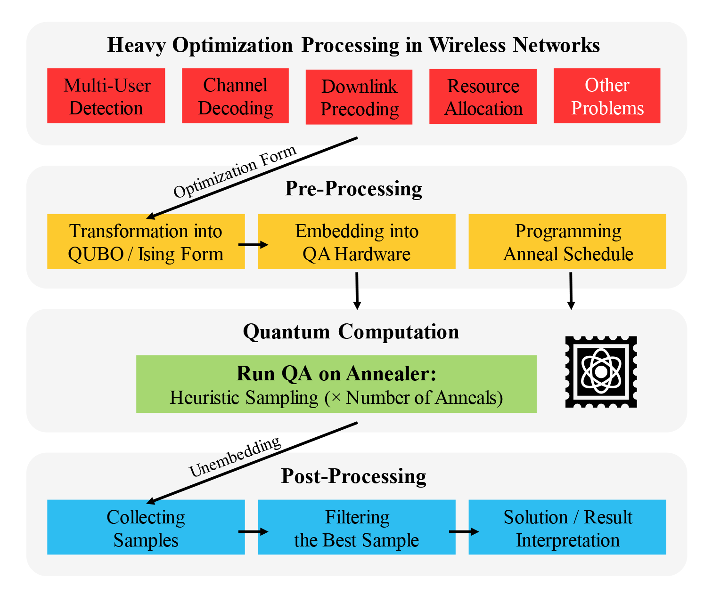
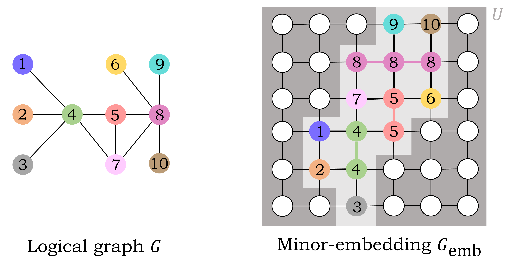
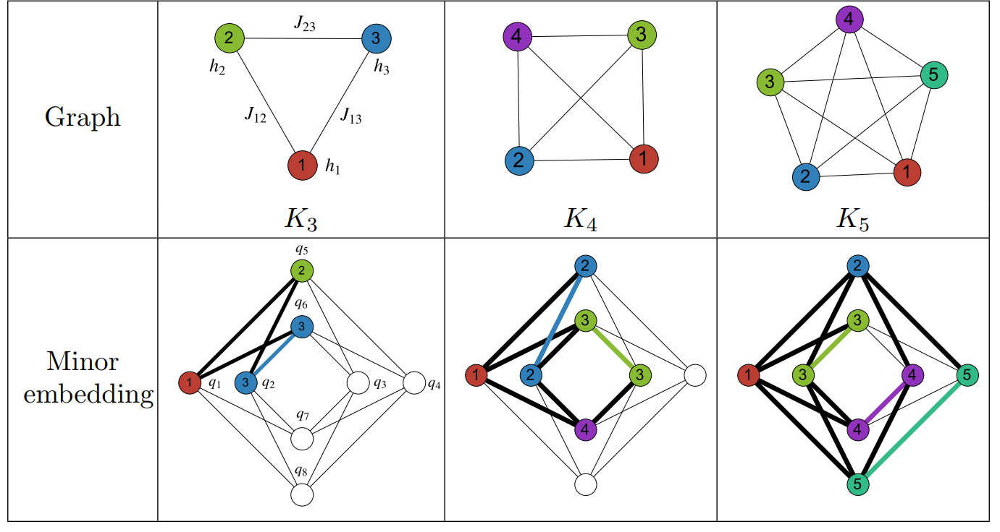
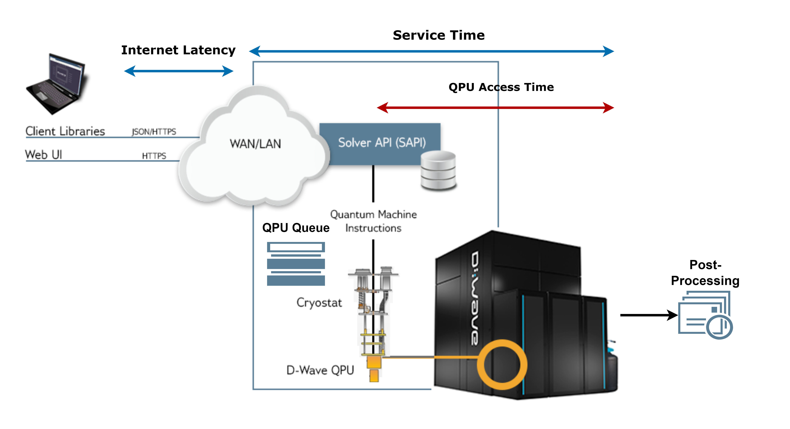
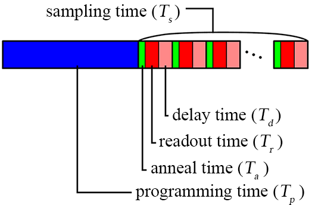

# From the NOMA QUBO to QPU samples

This guide explains the supplied thesis illustrations alongside the optional Leap experiment in [`notebooks/noma_detection.ipynb`](../notebooks/noma_detection.ipynb) and the `sample_qpu` adapter in [`src/noma_detection.py`](../src/noma_detection.py). The figures describe concepts and timing components; they are not new performance measurements. For the coefficients and symbol encodings, see the [QUBO derivation](QUBO_DERIVATION.md).

## 1. Optimization workflow

*From a detection problem to candidate solutions.* The top row lists wireless optimization applications. This repository implements the multi-user detection case: construct the received-signal least-squares QUBO, embed it on the QPU, collect repeated annealing samples, unembed them, and interpret the lowest-energy returned bit vector as a candidate transmitted vector. Channel decoding, precoding, and resource allocation are broader applications illustrated for context.

The optional experiment calls `EmbeddingComposite(DWaveSampler()).sample_qubo(...)`. The composite handles embedding and unembedding, and `num_reads` controls the requested number of samples. The figure's anneal-schedule block represents a general configuration step; the current adapter does not supply a custom schedule. Quantum annealing is heuristic, so the best returned sample need not be the global minimum. The notebook compares it with exhaustive ML for the same received frame.

## 2. Logical variables and physical qubit chains

*A logical variable can require several physical qubits.* The left graph contains ten logical variables. In the right graph, variable 4 occupies two connected vertices, variable 5 occupies two, and variable 8 occupies three. Matching colors and labels identify the same logical variable. Couplers between different chains represent the logical interactions; strong ferromagnetic couplings within each chain encourage its qubits to agree. The background grid is an illustrative hardware graph, not the topology or embedding returned by a particular live solver.

*Dense interactions increase embedding requirements.* The top row shows complete logical graphs $K_3$, $K_4$, and $K_5$. The bottom row embeds them in a Chimera $K_{4,4}$ unit cell. Bold black edges realize logical couplings; colored edges join physical qubits representing the same variable. These examples use four, six, and eight physical qubits, respectively, to represent three, four, and five logical variables.

The NOMA QUBO has a variable for each encoded bit and can have many pairwise interactions. A bit count therefore does not directly specify the required physical qubit count. Chain length and the available solver graph also matter. Chains that disagree after readout require a chain-break resolution method during unembedding. See [D-Wave's minor-embedding documentation](https://docs.dwavequantum.com/en/latest/quantum_research/embedding_intro.html) for the formal mapping and chain treatment. The historical Chimera examples above do not prescribe the topology selected by `DWaveSampler()`.

## 3. Reading returned samples

The [QPSK distance-to-energy illustration](QUBO_DERIVATION.md#interpreting-distance-as-energy) shows why a lower encoded energy corresponds to a smaller squared residual. `sample_qpu` selects `sampleset.first.sample` and adds the constant residual offset back to its energy. Its returned metadata includes the solver name, requested reads, energy with offset, and the solver's timing dictionary.

Repeated reads may return the same bit vector. Energy ranking and occurrence frequency describe different aspects of the returned sample set: the adapter chooses the lowest-energy sample, rather than a vote across samples. One frame and a finite set of reads do not establish a BER result or guarantee exact ML recovery.

## 4. Client, service, and QPU timing

*Timing boundaries.* The diagram distinguishes network latency, service processing, and QPU execution. Service time includes queueing and server processing around QPU access. Client-observed time also includes communication latency; timing a whole application call can additionally include local formulation, embedding, and decoding. Consequently, an anneal duration alone is not an end-to-end detection latency. See [D-Wave's operation and timing documentation](https://docs.dwavequantum.com/en/latest/quantum_research/operation_timing.html).

*Inside QPU execution.* Blue denotes programming time $T_p$. Each read then includes annealing $T_a$ (green), readout $T_r$ (red), and a delay $T_d$ (pink). For $R$ reads, the diagram gives the approximation

$$
T_s \approx R(T_a+T_r+T_d),
$$

where $T_s$ is total sampling time. Physical access also includes initialization overhead. D-Wave reports that overhead separately from the `qpu_access_time` field. Timing fields are in microseconds; use the returned fields and their documented definitions when reporting a run, rather than estimating elapsed client time from this schematic.

The adapter returns these fields without measuring client wall-clock time. Keep QPU timing, classical receiver runtime, and end-to-end application latency separate when comparing experiments. The [README](../README.md#what-the-project-demonstrates) also distinguishes the historical thesis measurements from the fresh classical reference experiment.

## Figure context

The image files are the supplied project illustrations, preserved without alteration. Their thesis context is in [Chapter 1](../tex/Chapter1/chapter1.tex) (C-RAN architecture), [Chapter 2](../tex/Chapter2/ee599-chapter2.tex) (channel model), and [Chapter 3](../tex/Chapter3/ee599-chapter3.tex) (embedding, timing, workflow, and distance/energy interpretation). Chapter 3 cites D-Wave for timing and the embedding literature for the clique examples; the original bibliography remains in [`references-fixed.bib`](../tex/References/references-fixed.bib). The generic grid embedding is included here as an additional supplied explanatory illustration. See the [asset index](../assets/README.md) for all eight placements.
